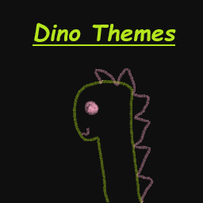
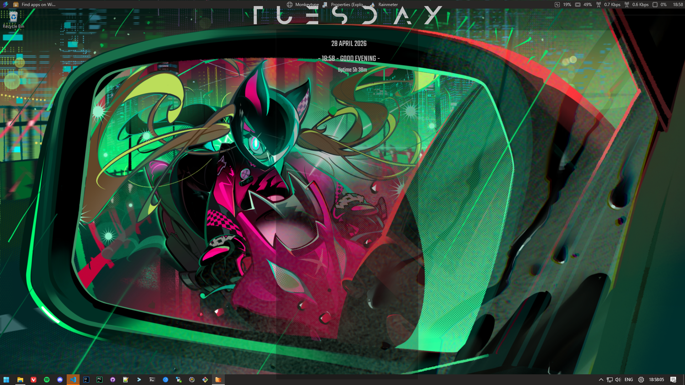
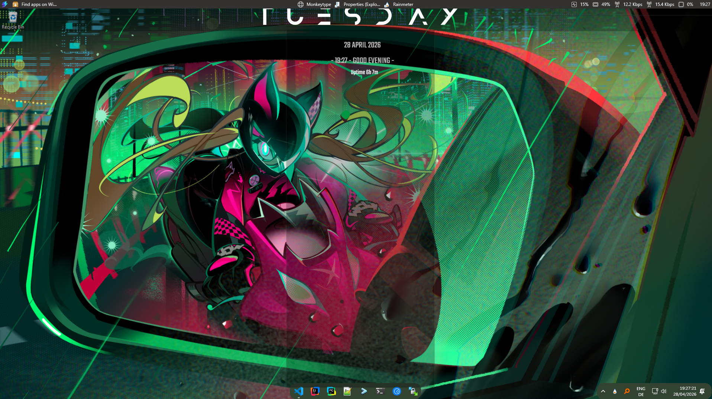
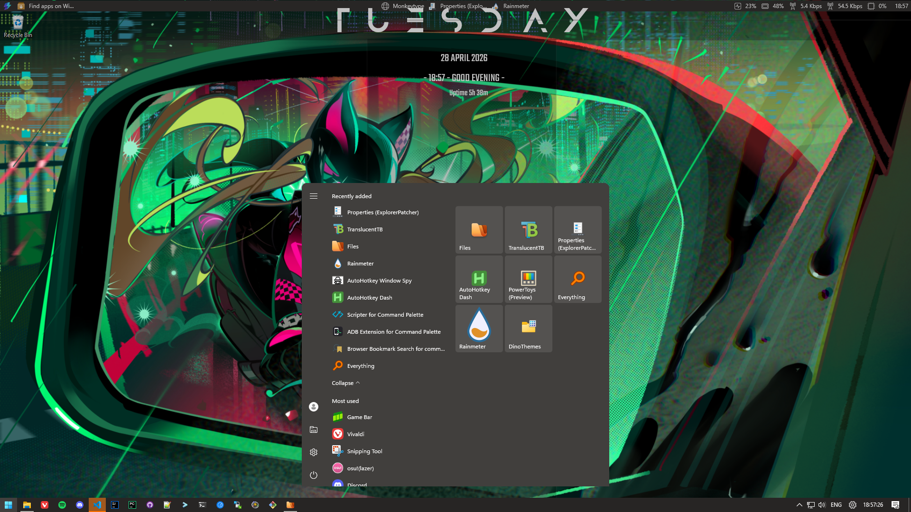
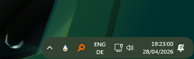
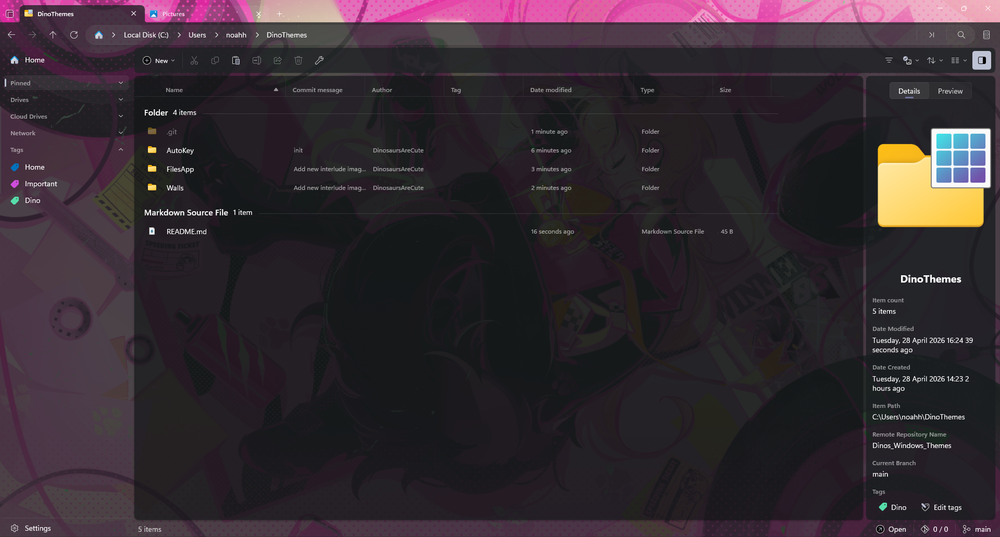

<table width="100%" border="0" cellpadding="0" cellspacing="0">
  <tr>
    <td width="80%"><h1>Dinos Windows Themes</h1></td>
    <td width="20%" align="right"></td>
  </tr>
</table>

<p align="left">
  <a href="https://github.com/DinosaursAreCute/Dinos_Windows_Themes/releases/latest"></a>
  <a href="https://github.com/DinosaursAreCute/Dinos_Windows_Themes/releases"></a>
  <a href="https://github.com/DinosaursAreCute/Dinos_Windows_Themes/actions/workflows/build.yml"></a>
  <a href="https://github.com/DinosaursAreCute/Dinos_Windows_Themes/releases"></a>
</p>

Is windows to serious of a joke to you? Do you want to make it look like a cute and colorful desktop environment that would horrify even the most hardcore linux ricer? Then this is the theme pack for you! With a combination of Rainmeter skins, ExplorerPatcher profiles, PowerToys settings and AutoHotkey scripts, this theme pack will transform your windows experience into *something*... 
---
> [!WARNING]
> ## Known Issues
>
> ### Installer
> - Installer Failing if selected save location is not empty 
> - Applying Accent Color Does not work consistently
> - Setting Auto Start for Auto Hotkey script does not work consistently
> - PowerToys not being recognized as installed if installation was set per User
> - Some Settings Imports do not work
>
> ### Rounded TB 
> - Opening an application in full screen breaks roundedTb
> - Some pinned Taskbar items might not be visible
> - Item spacing being inconsistent
>
> ### TranslusentTB 
> - Accent Color randomly looking different due to translusenttb restarting / reverting to default settings
>
> ### Rainmeter
> - Some elements overlapping taskbar
> - Wallpaper being wrong when switching workspaces
>
> ### FilesApp
> - Windows Explorer opening when using shortcut for explorer if files app has not yet been started 
>
> ---
## 🦕 Showcase

---

### Desktop

A beautiful and modern desktop look that would even satisfy linux ricers

<p align="center">
  
</p>

Alternative desktop with a more minimal and clean look:
<p align="center">  
  
</p>

---

### Taskbar & Start Menu

Ever though a square taskbar is to boring? THREAT NO LONGER, FOR DINO HAS COME TO BRING YOU THE CURVES YOU DESERVE:

<p align="center">
  
</p>

<p align="center">
  
</p>
<p align="center">
  
</p>

---

### Waybar esq Dock

Have you ever though "I wish I could see System information at all times and have useful shortcuts right at my fingertips"? WELL NOW YOU CAN WITH THE POWER OF THE POWERTOY DOCK:

<p align="center">
  
</p>

---

### File Explorer

Tired of Microsoft taking away features from the file explorer? Dino has the solution (rather the Files App does, but Dino is the one recommending it so...):

<p align="center">
  
</p>

---

### Workspace Management

Ugh window managment am I right? A bit better with the custom workspace hotkeys with wich you can easily snap windows to 9 different workspaces and switch between them with a single keypress (well technically its two). Press windows+shift+2 and... OH THIS IS KINDA LIKE HYPRLAND!

---

### Custom Keybinds

Tired of using your mouse? No longer, with the power of the power toys keyboard manager you can set up custom shortcuts for everything :D
And everything you can not do there you can in AutoHotKey, like the workspace controls mentioned above.

I have added my personal custom keybinds to the repository as an example, but feel free to change them up to your liking!

#### Workspaces — AutoHotkey

| Shortcut | Action |
| --- | --- |
| `Win + 1` … `Win + 9` | Switch to workspace 1–9 |
| `Win + Shift + 1` … `Win + Shift + 9` | Move active window to workspace 1–9 |

#### App Launchers — PowerToys Keyboard Manager

| Shortcut | Opens |
| --- | --- |
| `Win + Enter` | Windows Terminal |
| `Win + Backspace` | VS Code |
| `Win + S` | Spotify |
| `Win + W` | Vivaldi |
| `Win + F` | Everything (file search) |
| `Win + O` | Obsidian |

#### Remaps — PowerToys Keyboard Manager

| From | To | Effect |
| --- | --- | --- |
| `Win + Q` | `Alt + F4` | Close active window |

## What in the fuck is this?

- Cutesy meets Urban Brutality!
- ExplorerPatcher profile presets for taskbar and shell behavior.
- AutoHotkey workspace controls using Win+1..9 and Win+Shift+1..9.
- Rainmeter skin package
- Files App Theme for a more fun explorer experience (and features that Microsoft took away hehe)

## Prerequisites
To use all that this theme offers you will need to download some stuff (yep its a lot).
Dont worry you will not have to research all of this, either use the links below or wait for the installer to tell you the exact same thing!
I would recommend to check out their documentation if you wanna know more :D

| Tool | Website | GitHub |
| --- | --- | --- |
| PowerToys | [PowerToys](https://learn.microsoft.com/en-us/windows/powertoys/) | [microsoft/PowerToys](https://github.com/microsoft/PowerToys) |
| ExplorerPatcher | [ExplorerPatcher](https://github.com/valinet/ExplorerPatcher) | [valinet/ExplorerPatcher](https://github.com/valinet/ExplorerPatcher) |
| Files App | [files.community](https://files.community) | [files-community/Files](https://github.com/files-community/Files) |
| RoundedTB | [roundedtb.github.io](https://roundedtb.github.io) | [RoundedTB/RoundedTB](https://github.com/RoundedTB/RoundedTB) |
| TranslucentTB | [translucenttb.github.io](https://translucenttb.github.io) | [TranslucentTB/TranslucentTB](https://github.com/TranslucentTB/TranslucentTB) |
| Rainmeter | [rainmeter.net](https://www.rainmeter.net) | [rainmeter/rainmeter](https://github.com/rainmeter/rainmeter) |
| AutoHotkey v2 | [autohotkey.com](https://www.autohotkey.com) | [AutoHotkey/AutoHotkey](https://github.com/AutoHotkey/AutoHotkey) |

## Installer (Recommended)

### GUI Installer

#### Prebuilt executable:
1. Download the latest release from the Releases tab.
2. Run DinoThemesInstaller.exe and follow the prompts.

#### Build from source using PyInstaller:

1. Clone or download this repository to a local folder (example: C:\Users\<you>\DinoThemes).

2. build installer executable:
```powershell
cd installer
python make_assets.py
pyinstaller build.spec --noconfirm
```

The executable will be generated at installer/dist/DinoThemesInstaller.exe.

### Silent CLI Mode

The installer also supports a silent mode:

```powershell
cd installer
python main.py --silent --dest C:\DinoThemes --yes
```

Useful flags:

- --beta (install from main branch)
- --apply-explorerpatcher
- --autostart
- --interlude87
- --set-accent-color
- --no-apply-theme
- --no-backup-configs

## Manual Installation

1. Clone or download this repository to a local folder (example: C:\Users\<you>\DinoThemes).
2. Create a restore point and backup current configs.
3. Copy Wallpapers from Walls to Pictures\DinoThemes\Walls and set your preferred one.
4. Run AutoKey/workspaces.ahk with AutoHotkey v2 (keep the dll folder beside it).
5. Apply ExplorerPatcher profile from ExplorerPatcher (newest recommended).
6. Install latest Rainmeter skin from Rainmeter.
7. Optionally import Files App and PowerToys settings.
8. Restart Explorer or sign out/in if shell changes do not appear.

## Repository Contents

- Walls: wallpapers
- AutoKey: AutoHotkey scripts + required DLL
- ExplorerPatcher: profile presets
- Rainmeter: rmskin packages
- FilesApp: Files settings export
- PowerToys: PowerToys backup file
- installer: GUI/CLI installer source + build assets
- Screenshots: visual showcase images

## Credits

- Rainmeter Assets: [Kaelri/Enigma](https://github.com/Kaelri/Enigma)
- Wallpapers: [Muse Dash](https://musedash.peropero.net)
- Windows PowerToys: [Microsoft](https://learn.microsoft.com/en-us/windows/powertoys/)
- ExplorerPatcher: [valinet](explorerpatcher.github.io)
- Files App: [Files Community](https://files.community)
- RoundedTB: [RoundedTB](https://roundedtb.github.io)
- TranslucentTB: [TranslucentTB](https://translucenttb.github.io)
- AutoHotkey: [AutoHotkey](https://www.autohotkey.com)
  

## Notes

- This project is designed for Windows 11.
- ExplorerPatcher profile import modifies shell/taskbar behavior.
- Always keep backups before applying changes.
